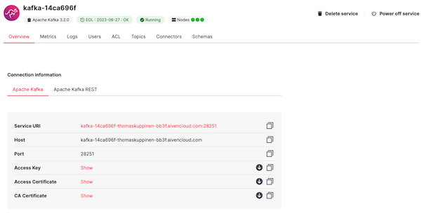

# Creating an Obsservable Data Platform Using Aiven.io

## Table of Contents
---------------------

* [Introduction](#introduction)
* [Why Kafka?](#why-kafka)
* [Importance of Observability](#importance-of-observability)
* [Aiven Kafka setup](#aiven-kafka-setup)
* [Aiven Observability Setup](#aiven-observability-setup)
* [Python pre-requisites](#python-pre-requisites)
* [Running Python Script](#running-the-python-script)
* [Viewing Kafka Messages in Aiven Console](#viewing-kafka-messages-in-aiven)
* [Conclusion/Future Enhancements](#conclusionfuture-enhancements)


## Introduction 

The purpose of this project is to show how quickly you can create fully managed, cloud based, observable data platform using [Aiven](https://aiven.io) .  There are 3 main components to this project: 1) creating a Kakfa service and topic using the Aiven GUI 2) using Aiven GUI, creating a Grafana Dashboard for observability of your Kafka service 3) running a python script to simulate a video application use case of sending viewership data to a Kafka topic.

## Why Kafka
Apache Kafka has tremendous market adoption and is widely considered to be a foundational component of a modern data archtiecture, but why is this the case?   As systems grow increasingly more complex and applications capture more events and data, we need a reliable way to capture not only data coming into our systems but also to distribute data to various components.  Consider our use case of video views, in real time there may be the need to send this data to a customer NOC for monitoring of video quality, AI/ML systems that build recommendations based on customer viewing behaviors, CRM systems to log customer behavior, and many more.  Implementing Apache Kafka provides a fast, resilient, horizontally scalable mechanism to not only capture but distribute this data. However, with these benefits also comes increasing complexity of management and implementation for TechOps organizations. Aiven's fully managed data platform makes this process simple and allows customers to focus on adding value to business.

## Importance of Observability
As modern systems become increasingly distributed and more complex in nature, the concept of observability and being able to identify sytem weakness and poor performing components becomes even more important.  While implementing observability, detailed metrics about the system components, also enables monitoring and creating reactive alerts what we want to achieve with an observable system is the ability to identify issues before they result in outages or degraded system performance.

## Aiven Kafka Setup

To get Started with Aiven, you will need to [create an account](https://console.aiven.io/login) .  Once you have logged in you can navigate to the services view to create an Apache Kafka service. For more complete instructions please reference [this article](https://docs.aiven.io/docs/products/kafka/getting-started.html) 

Once you have created the service, click on new Service in the Services view and you will see the following. 
 

**You will need to download the Access Key, Access Certificate, and CA Certificate to run the Python Script.**   

From the Service Overview page, you will also need to enable the Apache Kafka REST API (Karapace) flag to be able to view messages in the console.   

Finally, we can create our Kakfa topic we will use in the Python program.  Click on the Topics tab under the Kafka Service detail.  From here you simply enter the topic name of your choice.  You will use this topic name in the Python program later on.


## Aiven Observability Setup  
Now that we've created a Kakfka Service and Kakfa topic for our events, we will next set up our Observability components.  Using Aiven, we can simply add an [InfluxDB](https://www.influxdata.com/)  integration to our existing Kafka Service.  From the Service Overview Page simple click on the Manage Integrations button, from there you will be provided a menu of available integrations, select the Metrics integration option -> New Service -> New InfluxDB Service.


Once your InfluxDB Service is created, we can simply add a [Grafana](https://grafana.com/) integration to the InfluxDB service by clicking on the Manage Integrations button and adding a Grafana integration.  
 
## Python pre-requisites
This script requires Python 3.10 at a minimum and also requires the installation of two additonal python modules: [python-dotenv](https://pypi.org/project/python-dotenv/) for managing environment variables and [kafka-python](https://kafka-python.readthedocs.io/en/master/) for sending messages. Below shows how they can be installed on a Mac using a terminal window.

```
pip3 install python-dotenv
pip3 install kafka-python
```

Additonally, you will need to create a file named .env to store your Aiven Kafka Service connection parameters.  See below for the required lines. 
```
KAFKA_SSL_CAFILE_LOC="[PATH TO YOUR CA.PEM FILE]ca.pem"
KAFKA_SSL_CERT_LOC="[PATH TO YOUR SERVICE CERT]service.cert"
KAFKA_KEYFILE_LOC="[PATH TO YOUR SERVICE KEY]service.key"
KAFKA_BOOTSTRAP_URL="[BOOTSTRAP URL FROM AIVEN SERVICE OVERVIEW PAGE]"
```

## Running the Python Script 

Running the script itself is pretty simple, requires two parameters a topic name and the number of view beacons to send (1 per second) to the topic you createfd .  See below for an example using the Mac terminal command line 

```
python3 createViews.py -t video.views -v 5

```

## Viewing Kafka Messages in Aiven

Once you've run the script, now we can go view the messages themselves in the Aiven UI.  From the Service detail page, click on Topics, then navigate to the horizontal tri-dot menu option next to your topic.  From there, select the Apache Kafka REST option (screen shot below)


Change the format option to json from binary and click the fetch messages button you will see the messages generated by the Python script in a human readable form.


## Conclusion/Future Enhancements

From beginning to end, this should take 15-20 minutes and what you're left with is the foundation of an obserable modern data platform powered by Aiven with a functional Kafka service that can be scaled as needed to meet demands of your system.  Future versions of this project may include:

- Windows instructions
- Cassandra sink implementation to store view data
